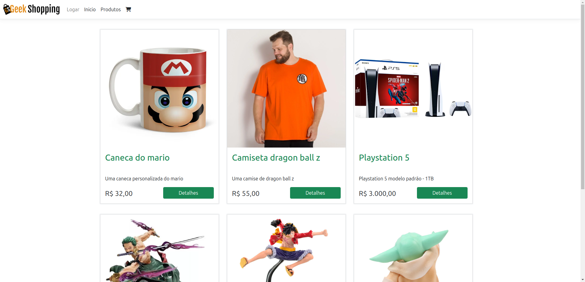

# GeekShopping

## sobre
O geekShopping é um E-Commerce, basicamente um projeto feito usando a Arquitetura de Microsserviços com .NET 8 e ASP.NET   
que tem como objetivo estudar e praticar varios conceitos da programação e do back-end como orientação a objetos, API's, asp net, entity framework
Razor pages para o front end, arquitetura de microsserviços, autenticação, oauth2 e jwt, rabbitmq,filas e exchanges, comunicação sincrona e assincrona entre microsserviços e uma api gateway para entrypoint entre as aplicações

## Esquema 

## Microsserviços
GeekShooping.ApiGateway ` é a api gateway `
GeekShooping.Web  ` é o frontend da aplicação `
GeekShooping.CartApi ` é o serviço responsavel pelo carrinho de compras `
GeekShooping.CouponApi `é o serviço de coupon de disconto `
GeekShooping.Email ` responsavel por logs `
GeekShooping.IdentityServer ` é o servidor de identificação `
GeekShooping.OrderApi ` é responsavel por gerenciar os pedidos e adicionar filas ao rabbitmq `
GeekShooping.PaymentApi ` é apenas um mock que simula um pagamento ficiticio `
GeekShooping.ProductApi ` é a api de produtos `

## Endpoints 
### Todos os endpoints estão configurados na ApiGateway, basta acessa la em localhost:4481

